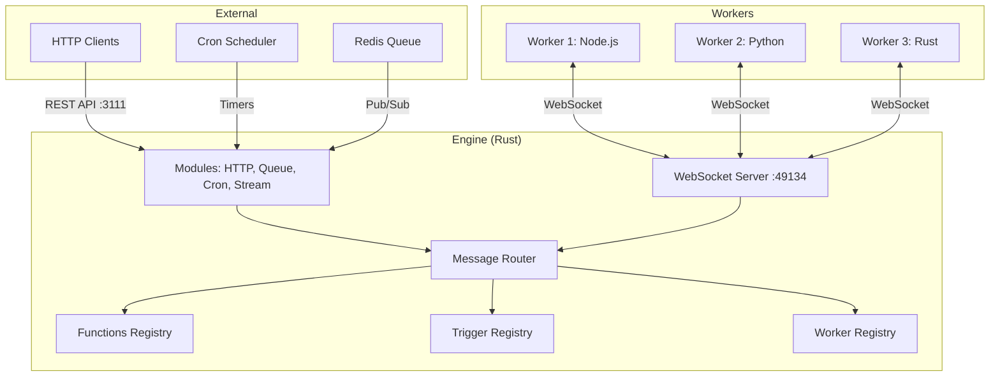
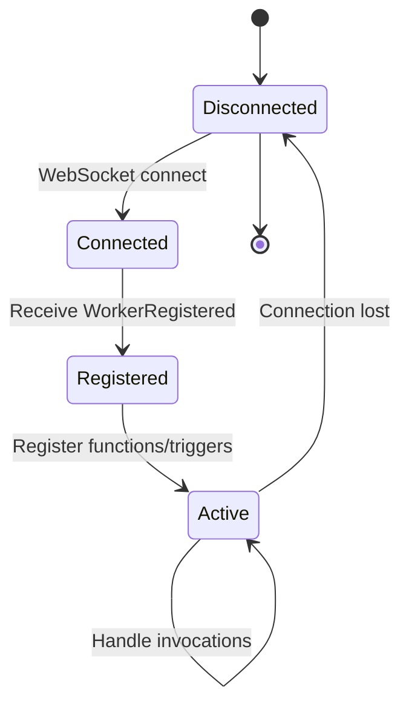
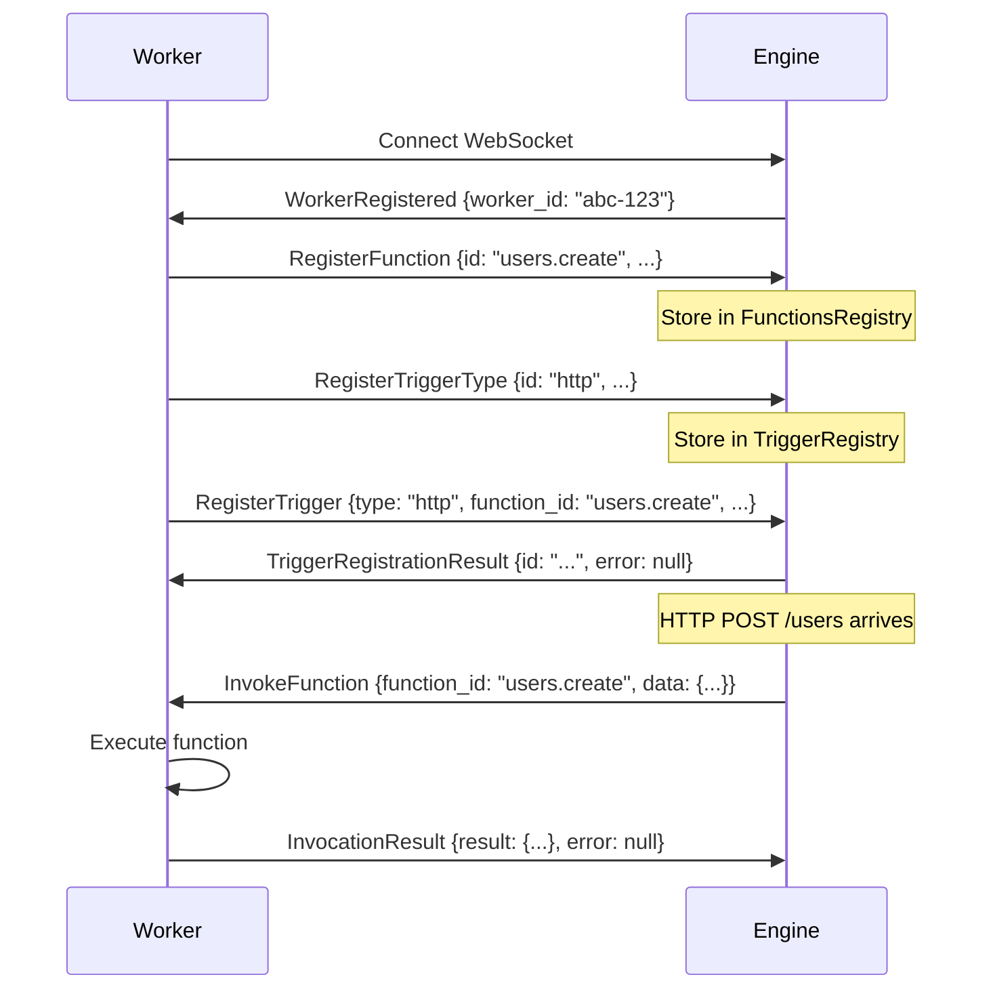
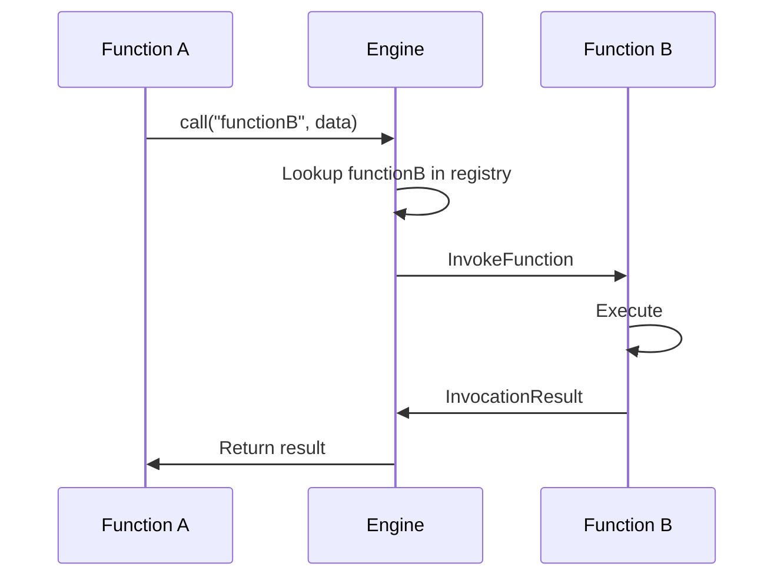
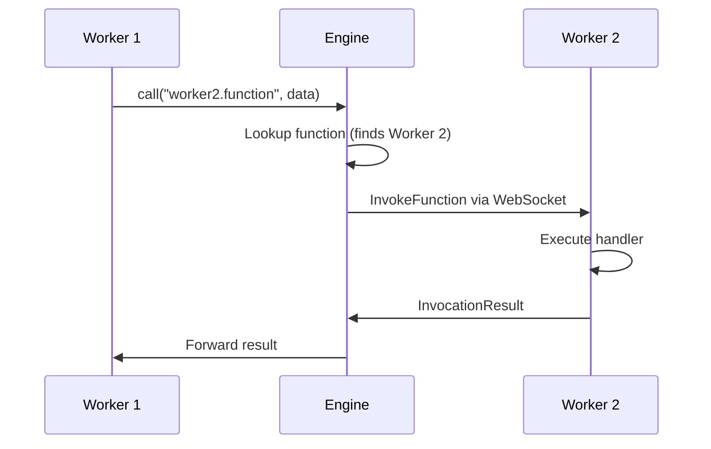

## System Overview

iii uses a centralized engine + distributed worker architecture connected via WebSocket. The engine coordinates routing and discovery, while workers execute functions and manage trigger types.



<Info>
The engine is a single Rust process. Workers are separate processes in any language (Node.js, Python, Rust, etc.) that connect via WebSocket.
</Info>

## The Engine

The engine is the central orchestration hub written in Rust. It manages:

- **WebSocket connections** from workers
- **Function registry** for discovering and routing calls
- **Trigger registry** for event-to-function mappings
- **Worker registry** for tracking connected workers
- **Modules** for built-in functionality (HTTP API, Queue, Cron, etc.)
- **Invocation handling** for request/response coordination

### Engine Structure

```rust
pub struct Engine {
    pub worker_registry: Arc<WorkerRegistry>,
    pub functions: Arc<FunctionsRegistry>,
    pub trigger_registry: Arc<TriggerRegistry>,
    pub service_registry: Arc<ServicesRegistry>,
    pub invocations: Arc<InvocationHandler>,
    pub channel_manager: Arc<ChannelManager>,
}
```

All registries use thread-safe concurrent data structures (`DashMap`, `Arc<RwLock<T>>`) for lock-free access.

### Default Ports

| Port  | Service                        |
| ----- | ------------------------------ |
| 49134 | WebSocket (worker connections) |
| 3111  | HTTP API                       |
| 3112  | Stream API (WebSocket)         |
| 9464  | Prometheus metrics             |

### Starting the Engine

```bash
# Default configuration
iii

# With custom config
iii --config config.yaml

# Custom WebSocket port
iii --port 50000
```

## Workers

Workers are processes that connect to the engine and provide functions. Workers can be written in any language with a iii SDK.

### Worker Capabilities

- **Register functions**: Make code executable by the engine
- **Register trigger types**: Declare support for event sources (http, cron, etc.)
- **Register triggers**: Connect event sources to functions
- **Invoke functions**: Call other functions across the system
- **Stream telemetry**: Send OpenTelemetry traces, metrics, and logs

### Worker Lifecycle



### Worker Implementation

<CodeGroup>

```javascript Node.js Worker
import { init } from 'iii-sdk';

const iii = init('ws://localhost:49134');

// Register capabilities
iii.registerFunction({ id: 'hello' }, async (input) => {
  return { message: `Hello, ${input.name}!` };
});

iii.registerTrigger({
  type: 'http',
  function_id: 'hello',
  config: { api_path: 'hello', http_method: 'POST' }
});

// SDK handles connection, reconnection, heartbeat
await iii.connect();
```

```python Python Worker
from iii import III
import asyncio

iii = III("ws://localhost:49134")

async def hello(data):
    return {"message": f"Hello, {data['name']}!"}

iii.register_function("hello", hello)

async def main():
    await iii.connect()
    
    iii.register_trigger(
        type="http",
        function_id="hello",
        config={"api_path": "hello", "http_method": "POST"}
    )
    
    # Keep running
    await asyncio.Event().wait()

if __name__ == "__main__":
    asyncio.run(main())
```

```rust Rust Worker
use iii_sdk::III;
use serde_json::json;

#[tokio::main]
async fn main() -> Result<(), Box<dyn std::error::Error>> {
    let iii = III::new("ws://127.0.0.1:49134");
    iii.connect().await?;

    iii.register_function("hello", |input| async move {
        let name = input.get("name")
            .and_then(|v| v.as_str())
            .unwrap_or("World");
        Ok(json!({ "message": format!("Hello, {}!", name) }))
    });

    iii.register_trigger("http", "hello", json!({
        "api_path": "hello",
        "http_method": "POST"
    }))?;

    // SDK keeps connection alive
    iii.wait_for_shutdown().await;
    Ok(())
}
```

</CodeGroup>

## WebSocket Protocol

Workers and the engine communicate via JSON messages over WebSocket. The protocol is bidirectional and async.

### Message Types

| Message                      | Direction       | Purpose                                    |
| ---------------------------- | --------------- | ------------------------------------------ |
| `WorkerRegistered`           | Engine → Worker | Confirm connection, provide worker ID      |
| `RegisterFunction`           | Worker → Engine | Register a callable function               |
| `UnregisterFunction`         | Worker → Engine | Remove a function                          |
| `RegisterTriggerType`        | Worker → Engine | Declare trigger type support               |
| `RegisterTrigger`            | Worker → Engine | Create a trigger instance                  |
| `UnregisterTrigger`          | Worker → Engine | Remove a trigger                           |
| `TriggerRegistrationResult`  | Engine → Worker | Confirm trigger registration               |
| `InvokeFunction`             | Bidirectional   | Request function execution                 |
| `InvocationResult`           | Bidirectional   | Return function result                     |
| `RegisterService`            | Worker → Engine | Register a logical service grouping        |
| `Ping` / `Pong`              | Bidirectional   | Keep-alive heartbeat                       |

### Example Protocol Flow



### Protocol Message Schemas

<AccordionGroup>
  <Accordion title="RegisterFunction">
    ```json
    {
      "type": "registerfunction",
      "id": "users.create",
      "description": "Create a new user",
      "request_format": {
        "email": {"type": "string"},
        "name": {"type": "string"}
      },
      "response_format": {
        "userId": {"type": "string"}
      },
      "metadata": null,
      "invocation": null
    }
    ```
  </Accordion>

  <Accordion title="InvokeFunction">
    ```json
    {
      "type": "invokefunction",
      "invocation_id": "550e8400-e29b-41d4-a716-446655440000",
      "function_id": "users.create",
      "data": {
        "email": "user@example.com",
        "name": "John Doe"
      },
      "traceparent": "00-abc123...-def456...-01",
      "baggage": "key1=value1,key2=value2"
    }
    ```
    
    **Note**: `invocation_id` is optional. Omit for fire-and-forget calls.
  </Accordion>

  <Accordion title="InvocationResult">
    ```json
    {
      "type": "invocationresult",
      "invocation_id": "550e8400-e29b-41d4-a716-446655440000",
      "function_id": "users.create",
      "result": {
        "userId": "user-123"
      },
      "error": null,
      "traceparent": "00-abc123...-def456...-01",
      "baggage": null
    }
    ```
    
    Either `result` or `error` will be set, not both.
  </Accordion>

  <Accordion title="RegisterTrigger">
    ```json
    {
      "type": "registertrigger",
      "id": "trigger-uuid",
      "trigger_type": "http",
      "function_id": "users.create",
      "config": {
        "api_path": "users",
        "http_method": "POST"
      }
    }
    ```
  </Accordion>
</AccordionGroup>

### Binary Protocol Extensions

In addition to JSON messages, iii supports binary WebSocket frames for high-performance telemetry:

- **OTLP prefix** (`OTLP`): OpenTelemetry trace spans
- **MTRC prefix** (`MTRC`): OpenTelemetry metrics
- **LOGS prefix** (`LOGS`): OpenTelemetry logs

These prefixes allow SDKs to stream telemetry without JSON serialization overhead.

## Invocation Flow

When a function is invoked, the engine coordinates the request/response lifecycle:

### Same-Worker Invocation



### Cross-Worker Invocation



### Fire-and-Forget

Omit `invocation_id` for async calls that don't need a response:

```javascript
// No await, no response
iii.call('notifications.send', { userId: '123' });
```

The engine routes the call but doesn't track the invocation.

## Modules

Modules are built-in engine plugins that provide functionality. They run inside the engine process and can register functions, trigger types, and services.

### Default Modules

| Module        | Class              | Purpose                                  |
| ------------- | ------------------ | ---------------------------------------- |
| HTTP          | `RestApiModule`    | HTTP API server, maps routes to functions|
| Queue         | `QueueModule`      | Redis-backed pub/sub queue               |
| Cron          | `CronModule`       | Distributed cron scheduling              |
| Stream        | `StreamModule`     | Real-time WebSocket streaming            |
| Observability | `OtelModule`       | Telemetry collection and export          |
| Shell         | `ExecModule`       | File watcher for dev workflows           |

### Module Configuration

Modules are configured in `config.yaml`:

```yaml
modules:
  - class: modules::rest_api::RestApiModule
    config:
      host: 0.0.0.0
      port: 3111
      
  - class: modules::queue::QueueModule
    config:
      adapter:
        class: adapters::redis::RedisQueueAdapter
        config:
          url: redis://localhost:6379
          
  - class: modules::cron::CronModule
    config:
      enabled: true
```

### Custom Modules

You can create custom modules in Rust:

```rust
use iii::modules::module::Module;

#[derive(Clone)]
pub struct MyModule {
    engine: Arc<Engine>,
}

#[async_trait]
impl Module for MyModule {
    fn name(&self) -> &'static str {
        "MyModule"
    }

    async fn create(engine: Arc<Engine>, config: Option<Value>) 
        -> anyhow::Result<Box<dyn Module>> 
    {
        Ok(Box::new(Self { engine }))
    }

    async fn initialize(&self) -> anyhow::Result<()> {
        // Register functions, trigger types, etc.
        Ok(())
    }
}
```

See [`examples/custom_queue_adapter.rs`](https://github.com/iii-hq/iii/blob/main/examples/custom_queue_adapter.rs) for a complete example.

## Observability

iii has built-in observability using OpenTelemetry:

### Distributed Tracing

All function invocations are traced with parent-child span relationships:

```
HTTP POST /users
  └─ users.create [Worker 1]
      ├─ users.validate [Worker 1]
      └─ users.store [Worker 2]
          └─ database.insert [Worker 2]
```

Traces include:
- `traceparent`: W3C Trace Context propagation
- `baggage`: Cross-cutting context metadata
- Automatic span creation and linking

### Metrics

Engine metrics exported on `:9464/metrics` (Prometheus format):

- `iii_workers_active`: Current worker count
- `iii_workers_spawns_total`: Total workers connected
- `iii_functions_registered_total`: Total functions registered
- `iii_invocations_total`: Function invocation count
- `iii_invocation_duration_seconds`: Invocation latency histogram

### Logs

Structured logging with `tracing`:

```
2026-03-03T12:00:00Z INFO [REGISTERED] Function users.create
2026-03-03T12:00:01Z INFO Worker 550e8400 connected
2026-03-03T12:00:05Z DEBUG Invoking function users.create
```

## Scalability Considerations

<CardGroup cols={2}>
  <Card title="Horizontal Workers" icon="arrows-left-right">
    Add more workers to scale function execution capacity
  </Card>
  
  <Card title="Single Engine" icon="server">
    Engine is single-process, vertically scaled (multi-threaded Rust)
  </Card>
  
  <Card title="Function Routing" icon="route">
    O(1) hash lookup, no coordination overhead
  </Card>
  
  <Card title="WebSocket Limits" icon="chart-line">
    Tested with 10,000+ concurrent worker connections
  </Card>
</CardGroup>

<Warning>
The engine is currently single-instance. For HA deployments, use external load balancers with session affinity, or run multiple isolated engine instances with separate worker pools.
</Warning>

## Security

### Network Security

- Engine binds to `127.0.0.1` by default (localhost only)
- Configure `host: 0.0.0.0` to accept external connections
- Use TLS-terminating reverse proxy (Caddy, nginx) for production

### Worker Authentication

Currently, worker connections are unauthenticated. For production:

1. Run engine behind a firewall
2. Use VPN or private networking
3. Implement custom auth in modules

### Function Invocation Security

- HTTP functions support auth configurations (Bearer, API key)
- External functions can use `auth` field for credentials
- Internal function calls are trusted (no auth)

## Next Steps

<CardGroup cols={2}>
  <Card title="Functions" icon="function" href="/concepts/functions">
    Learn about registering and invoking functions
  </Card>
  
  <Card title="Triggers" icon="bolt" href="/concepts/triggers">
    Connect event sources to functions
  </Card>
  
  <Card title="Configuration" icon="gear" href="/essentials/settings">
    Configure modules and engine settings
  </Card>
  
  <Card title="Development" icon="code" href="/development">
    Set up a local development environment
  </Card>
</CardGroup>