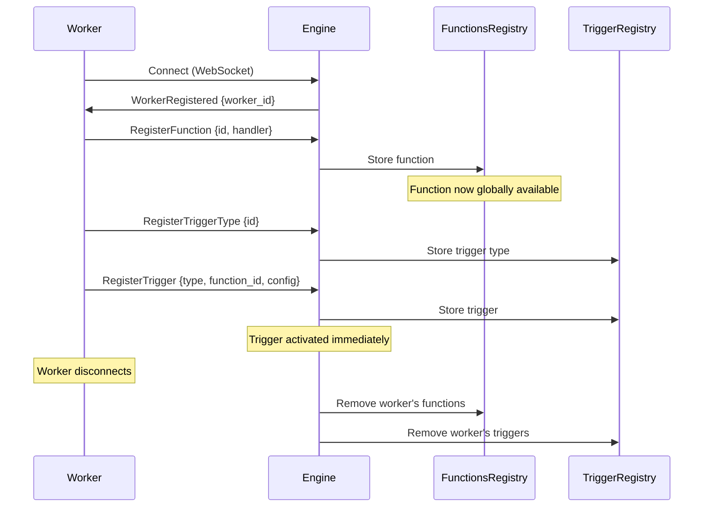

## What is Discovery?

Discovery is the system that automatically makes functions and triggers available across your entire backend application stack without manual configuration. When a worker connects and registers capabilities, they become immediately available to all other parts of the system.

<Info>
Discovery eliminates the need for service registries, API gateways, or configuration files. Everything is registered dynamically over the WebSocket protocol.
</Info>

## How Discovery Works

The discovery process follows this flow:

1. **Worker connects** to the engine via WebSocket
2. **Worker registers** its functions and trigger types
3. **Engine tracks** all registrations in thread-safe registries
4. **Functions become callable** by any other worker or module
5. **Worker disconnects**, all its registrations are cleaned up



## Worker Registration

When a worker first connects, the engine assigns it a unique ID and tracks it in the `WorkerRegistry`:

```rust
pub struct Worker {
    pub id: Uuid,
    pub channel: mpsc::Sender<Outbound>,
    pub function_ids: Arc<RwLock<HashSet<String>>>,
    pub external_function_ids: Arc<RwLock<HashSet<String>>>,
    pub invocations: Arc<RwLock<HashSet<Uuid>>>,
    pub runtime: Option<String>,
    pub version: Option<String>,
    pub connected_at: DateTime<Utc>,
    pub ip_address: Option<String>,
    pub status: WorkerStatus,
}
```

### Worker Lifecycle

<Steps>
  <Step title="Connection">
    Worker establishes WebSocket connection to engine (default port `49134`)
    
    ```javascript
    const iii = init('ws://localhost:49134');
    await iii.connect();
    ```
  </Step>
  
  <Step title="Worker ID Assignment">
    Engine generates a UUID and sends `WorkerRegistered` message:
    
    ```json
    {
      "type": "workerregistered",
      "worker_id": "550e8400-e29b-41d4-a716-446655440000"
    }
    ```
  </Step>
  
  <Step title="Capability Registration">
    Worker registers its functions and trigger types:
    
    ```javascript
    // Functions become discoverable
    iii.registerFunction({ id: 'users.create' }, handler);
    
    // Trigger types become available
    iii.registerTriggerType({ id: 'http', description: 'HTTP routes' });
    ```
  </Step>
  
  <Step title="Ready for Work">
    Worker is now fully integrated and can:
    - Execute functions registered by other workers
    - Have its own functions called by others
    - Register triggers that invoke any function
  </Step>
</Steps>

## Function Discovery

Functions are stored in the `FunctionsRegistry`, a concurrent hash map that allows lock-free lookups:

```rust
pub struct FunctionsRegistry {
    pub functions: Arc<DashMap<String, Function>>,
}

impl FunctionsRegistry {
    pub fn register_function(&self, function_id: String, function: Function) {
        tracing::info!("[REGISTERED] Function {}", function_id);
        self.functions.insert(function_id, function);
    }
    
    pub fn get(&self, function_id: &str) -> Option<Function> {
        self.functions.get(function_id).map(|entry| entry.value().clone())
    }
}
```

### Function Registration Protocol

<CodeGroup>

```json Local Function
{
  "type": "registerfunction",
  "id": "users.create",
  "description": "Create a new user",
  "request_format": {
    "email": { "type": "string" },
    "name": { "type": "string" }
  },
  "response_format": {
    "userId": { "type": "string" }
  },
  "metadata": null,
  "invocation": null
}
```

```json External Function (HTTP)
{
  "type": "registerfunction",
  "id": "external.my_lambda",
  "description": "External Lambda function",
  "invocation": {
    "url": "https://api.example.com/lambda",
    "method": "POST",
    "timeout_ms": 30000,
    "headers": {
      "x-api-key": "secret"
    },
    "auth": {
      "type": "bearer",
      "token_key": "LAMBDA_TOKEN"
    }
  }
}
```

</CodeGroup>

<Note>
**External functions** are special: they're stored in `external_function_ids` and invoke HTTP endpoints instead of local handlers. The engine manages the HTTP lifecycle transparently.
</Note>

## Trigger Discovery

Triggers have a two-tier discovery system:

### 1. Trigger Type Registration

Workers first declare what trigger types they support:

```javascript
// A worker declares it can handle HTTP triggers
iii.registerTriggerType({
  id: 'http',
  description: 'HTTP API routes'
});
```

This gets stored in the `TriggerRegistry`:

```rust
pub struct TriggerRegistry {
    pub trigger_types: Arc<DashMap<String, TriggerType>>,
    pub triggers: Arc<DashMap<String, Trigger>>,
}
```

### 2. Trigger Instance Registration

Once a trigger type exists, any worker can register trigger instances:

```javascript
// Any worker can now create HTTP triggers
iii.registerTrigger({
  type: 'http',           // Must match registered type
  function_id: 'users.create',  // Can be ANY function
  config: {
    api_path: 'users',
    http_method: 'POST'
  }
});
```

<Warning>
If you register a trigger before its type exists, the trigger is stored but not activated. It activates automatically when the trigger type is registered later.
</Warning>

## Cross-Runtime Discovery

Discovery works seamlessly across different runtimes. A Python worker can call functions registered by a Node.js worker, and vice versa:

```python
# Python worker
iii.register_function("python.process", process_data)
```

```javascript
// Node.js worker - can immediately call python.process
const result = await iii.call('python.process', { data: [...] });
```

```rust
// Rust worker - can also call python.process
let result = iii.call("python.process", json!({ "data": [...] })).await?;
```

## Automatic Cleanup

When a worker disconnects, the engine automatically cleans up all its registrations:

```rust
async fn cleanup_worker(&self, worker: &Worker) {
    // 1. Remove all regular functions
    let regular_functions = worker.get_regular_function_ids().await;
    for function_id in regular_functions.iter() {
        self.remove_function_from_engine(function_id);
    }
    
    // 2. Remove all external functions
    let external_functions = worker.get_external_function_ids().await;
    for function_id in external_functions.iter() {
        http_module.unregister_http_function(function_id).await?;
    }
    
    // 3. Halt all pending invocations
    let worker_invocations = worker.invocations.read().await;
    for invocation_id in worker_invocations.iter() {
        self.invocations.halt_invocation(invocation_id);
    }
    
    // 4. Unregister all triggers and trigger types
    self.trigger_registry.unregister_worker(&worker.id).await;
    
    // 5. Remove worker from registry
    self.worker_registry.unregister_worker(&worker.id);
}
```

<Info>
This automatic cleanup ensures that your system stays consistent even when workers crash or disconnect unexpectedly.
</Info>

## Service Discovery

In addition to functions and triggers, workers can register services:

```javascript
iii.registerService({
  id: 'user-service',
  name: 'User Management Service',
  description: 'Handles all user operations'
});
```

Services are logical groupings that help organize functions but don't affect routing.

## Discovery at Scale

The discovery system is designed for high concurrency:

- **Lock-free reads**: Uses `DashMap` for concurrent hash map access
- **Async message passing**: Workers communicate via async channels
- **Non-blocking registration**: Functions become available immediately
- **Distributed tracing**: All discovery operations are traced via OpenTelemetry

### Performance Characteristics

<CardGroup cols={2}>
  <Card title="Function Lookup" icon="magnifying-glass">
    **O(1)** hash map lookup with zero lock contention
  </Card>
  
  <Card title="Registration" icon="pen-to-square">
    **Instant** - no coordination or consensus required
  </Card>
  
  <Card title="Worker Cleanup" icon="broom">
    **Async** - cleanup runs in background without blocking
  </Card>
  
  <Card title="Cross-worker Calls" icon="right-left">
    **Single WebSocket hop** - direct routing via engine
  </Card>
</CardGroup>

## Discovery Events

You can listen for discovery events to react to changes:

```javascript
// Built-in trigger type for worker lifecycle
iii.registerTrigger({
  type: 'workers.available',
  function_id: 'monitor.workers',
  config: {}
});

iii.registerFunction({ id: 'monitor.workers' }, async (event) => {
  if (event.event === 'worker_connected') {
    console.log(`Worker ${event.worker_id} connected`);
  } else if (event.event === 'worker_disconnected') {
    console.log(`Worker ${event.worker_id} disconnected`);
  }
});
```

## Health and Introspection

You can query the discovery state at runtime:

```javascript
// List all registered functions
const functions = await iii.call('_internal.list_functions', {});

// List all workers
const workers = await iii.call('_internal.list_workers', {});

// Get worker details
const worker = await iii.call('_internal.get_worker', { 
  worker_id: '550e8400-e29b-41d4-a716-446655440000' 
});
```

## Best Practices

<CardGroup cols={2}>
  <Card title="Use namespaced IDs" icon="sitemap">
    Prefix functions with service name: `users.create`, `orders.process`
  </Card>
  
  <Card title="Register trigger types early" icon="bolt">
    Register trigger types on worker startup before any triggers
  </Card>
  
  <Card title="Handle connection loss" icon="wifi">
    Implement reconnection logic with exponential backoff
  </Card>
  
  <Card title="Monitor registrations" icon="chart-line">
    Track worker connection/disconnection events for observability
  </Card>
</CardGroup>

## Next Steps

<CardGroup cols={2}>
  <Card title="Architecture" icon="diagram-project" href="/concepts/architecture">
    Learn how the engine coordinates discovery across workers
  </Card>
  
  <Card title="Functions" icon="function" href="/concepts/functions">
    Deep dive into function registration and invocation
  </Card>
</CardGroup>