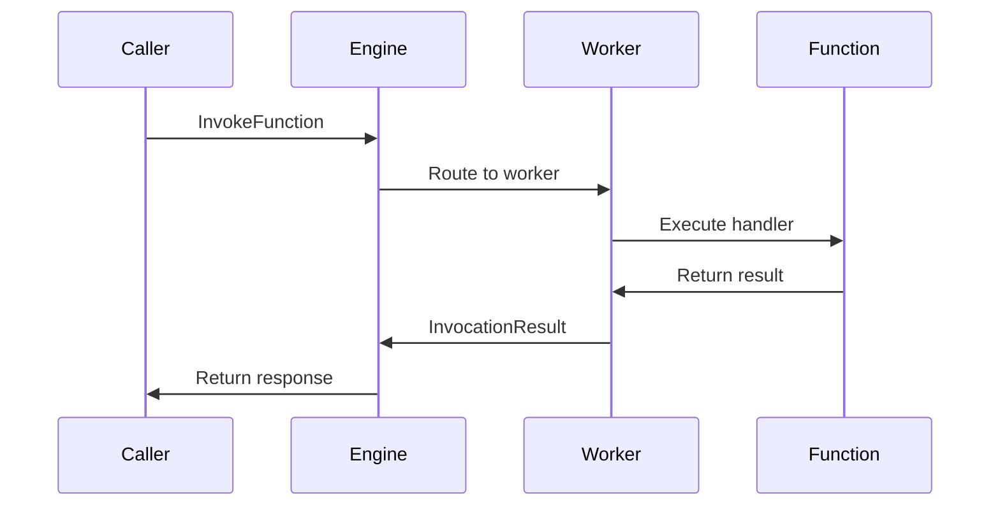

## What is a Function?

A **Function** is the core primitive in iii that represents any unit of work. Functions are language-agnostic, async-capable, and can exist anywhere - locally, in the cloud, on serverless platforms, or even as third-party HTTP endpoints.

<Info>
All functionality in your backend deconstructs into functions. They can mutate state, invoke other functions, modify databases, and do anything a typical function can do.
</Info>

## Key Characteristics

- **Universal**: Works across any runtime (Node.js, Python, Rust, etc.)
- **Async-first**: Built on async/await patterns for non-blocking execution
- **Location-independent**: Can run locally or as remote HTTP endpoints
- **Type-safe**: Optional request/response format schemas for validation
- **Observable**: Built-in distributed tracing with OpenTelemetry

## Function Structure

Every function in iii has:

- **ID**: A unique identifier (e.g., `math.add`, `users.create`)
- **Handler**: The actual code that executes when invoked
- **Input**: JSON data passed to the function
- **Output**: Optional JSON response returned by the function
- **Metadata**: Optional schema definitions and descriptive information

## Registering Functions

### Local Functions

Local functions run in your worker process. They're registered via the SDK and execute directly in your runtime.

<CodeGroup>

```javascript Node.js
import { init } from 'iii-sdk';

const iii = init('ws://localhost:49134');

// Register a simple function
iii.registerFunction({ id: 'math.add' }, async (input) => {
  return { sum: input.a + input.b };
});

// Register with schema validation
iii.registerFunction({
  id: 'users.create',
  description: 'Create a new user',
  request_format: {
    email: { type: 'string' },
    name: { type: 'string' }
  },
  response_format: {
    userId: { type: 'string' },
    created: { type: 'boolean' }
  }
}, async (input) => {
  const user = await db.users.create(input);
  return { userId: user.id, created: true };
});
```

```python Python
from iii import III

iii = III("ws://localhost:49134")

# Register a simple function
async def add(data):
    return {"sum": data["a"] + data["b"]}

iii.register_function("math.add", add)

# Register with metadata
async def create_user(data):
    user = await db.users.create(data)
    return {"userId": user.id, "created": True}

iii.register_function(
    "users.create",
    create_user,
    description="Create a new user",
    request_format={
        "email": {"type": "string"},
        "name": {"type": "string"}
    }
)
```

```rust Rust
use iii_sdk::III;
use serde_json::json;

#[tokio::main]
async fn main() -> Result<(), Box<dyn std::error::Error>> {
    let iii = III::new("ws://127.0.0.1:49134");
    iii.connect().await?;

    // Register a simple function
    iii.register_function("math.add", |input| async move {
        let a = input.get("a").and_then(|v| v.as_i64()).unwrap_or(0);
        let b = input.get("b").and_then(|v| v.as_i64()).unwrap_or(0);
        Ok(json!({ "sum": a + b }))
    });

    Ok(())
}
```

</CodeGroup>

### External Functions (HTTP Invocation)

External functions invoke third-party HTTP endpoints. The engine handles the HTTP request/response lifecycle transparently.

```javascript
iii.registerFunction({
  id: 'external.my_lambda',
  description: 'External Lambda function',
  invocation: {
    url: 'https://api.example.com/lambda',
    method: 'POST',
    timeout_ms: 30000,
    headers: {
      'x-api-key': process.env.LAMBDA_API_KEY
    },
    auth: {
      type: 'bearer',
      token_key: 'LAMBDA_TOKEN'
    }
  }
});
```

<Note>
External functions are invoked via HTTP but appear identical to local functions from a caller's perspective. The engine manages authentication, retries, and error handling.
</Note>

## Invoking Functions

### From Code

Functions can invoke other functions directly using the SDK:

```javascript
// Fire-and-forget (no response needed)
await iii.call('notifications.send', {
  userId: '123',
  message: 'Hello!'
});

// Wait for response
const result = await iii.call('math.add', { a: 5, b: 3 });
console.log(result.sum); // 8
```

### From Triggers

Functions are typically invoked automatically by [Triggers](/concepts/triggers). For example:

- HTTP trigger: `POST /users` → invokes `users.create`
- Cron trigger: every hour → invokes `reports.generate`
- Queue trigger: message arrives → invokes `jobs.process`

## Function Lifecycle

The function lifecycle in iii follows this flow:



## Function Results

Functions can return different result types:

<AccordionGroup>
  <Accordion title="Success">
    Function executed successfully and returned data:
    ```javascript
    return { sum: 8 };
    ```
  </Accordion>

  <Accordion title="Failure">
    Function encountered an error:
    ```javascript
    throw new Error('Invalid input');
    // Or explicitly return error
    return {
      error: {
        code: 'invalid_input',
        message: 'Input must be positive'
      }
    };
    ```
  </Accordion>

  <Accordion title="Deferred">
    Function accepted the work but will complete later (async background job):
    ```javascript
    // Start background job
    startBackgroundJob(input);
    return { status: 'deferred', jobId: 'abc123' };
    ```
  </Accordion>

  <Accordion title="NoResult">
    Function completed but has no response data:
    ```javascript
    // Fire-and-forget operations
    await logEvent(input);
    return; // or return null
    ```
  </Accordion>
</AccordionGroup>

## Internal Implementation

From the engine's perspective (Rust implementation), functions are stored in the `FunctionsRegistry`:

```rust
pub struct Function {
    pub handler: Arc<HandlerFn>,
    pub _function_id: String,
    pub _description: Option<String>,
    pub request_format: Option<Value>,
    pub response_format: Option<Value>,
    pub metadata: Option<Value>,
}

pub enum FunctionResult<T, E> {
    Success(T),
    Failure(E),
    Deferred,
    NoResult,
}
```

<Note>
The engine maintains a `FunctionsRegistry` (a thread-safe `DashMap`) that tracks all registered functions across all connected workers.
</Note>

## Best Practices

<CardGroup cols={2}>
  <Card title="Use descriptive IDs" icon="tag">
    Name functions with clear namespaces: `users.create`, `orders.process`, not `func1`, `doThing`
  </Card>
  
  <Card title="Keep functions focused" icon="bullseye">
    Each function should do one thing well. Compose complex workflows from simple functions.
  </Card>
  
  <Card title="Handle errors gracefully" icon="shield-check">
    Return structured error codes and messages. Avoid throwing generic errors.
  </Card>
  
  <Card title="Add schemas" icon="file-contract">
    Define request/response formats for validation and documentation.
  </Card>
</CardGroup>

## Next Steps

<CardGroup cols={2}>
  <Card title="Triggers" icon="bolt" href="/concepts/triggers">
    Learn how to automatically invoke functions with triggers
  </Card>
  
  <Card title="Discovery" icon="radar" href="/concepts/discovery">
    Understand how functions are discovered across workers
  </Card>
</CardGroup>