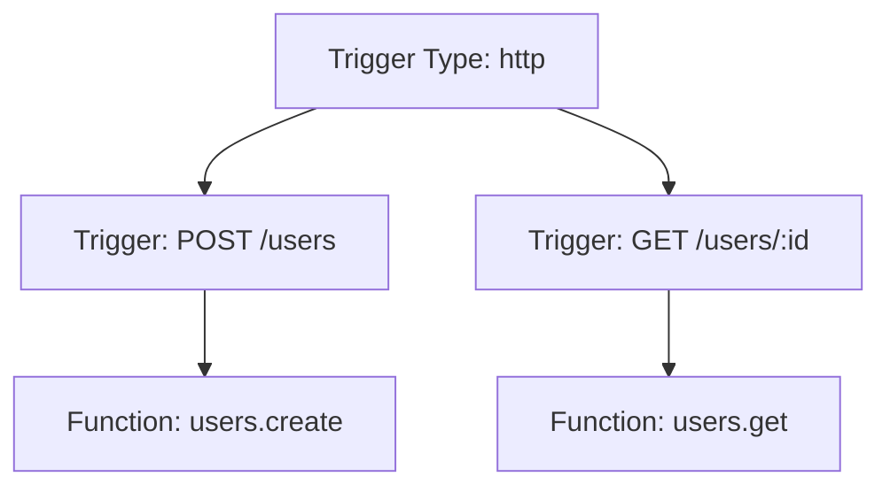
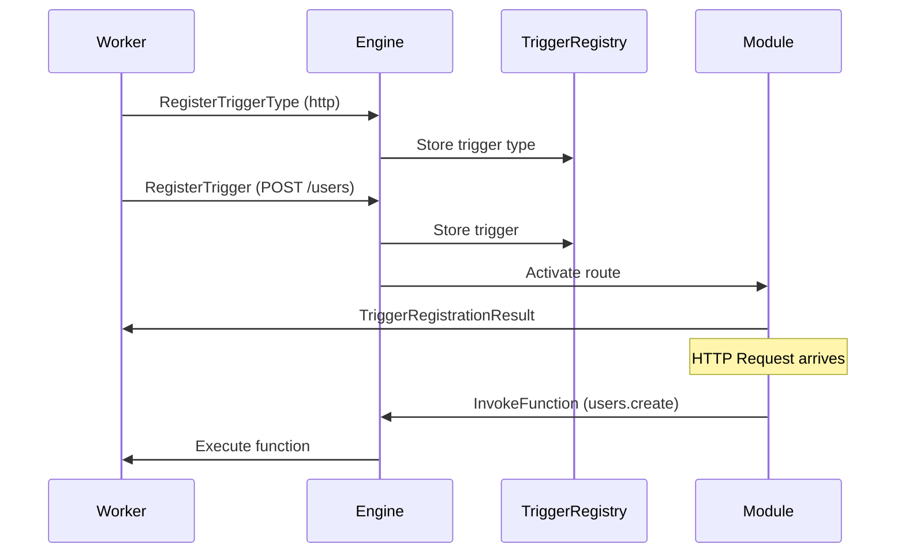

## What is a Trigger?

A **Trigger** is what causes a [Function](/concepts/functions) to run. Triggers connect event sources to your functions, enabling automatic execution in response to:

- HTTP requests
- Scheduled cron jobs
- Queue/pubsub messages
- Stream events
- Custom event sources

<Info>
Triggers decouple your business logic (functions) from how they're invoked. The same function can be triggered by HTTP, cron, or a queue without any code changes.
</Info>

## Trigger Architecture

Triggers have a two-level registration system:

1. **Trigger Types**: Define the kind of event source (e.g., `http`, `cron`, `queue`)
2. **Triggers**: Specific instances that connect a trigger type to a function



## Built-in Trigger Types

### HTTP Triggers

Map HTTP routes to functions. Powered by the `RestApiModule`.

```javascript
iii.registerTrigger({
  type: 'http',
  function_id: 'users.create',
  config: {
    api_path: 'users',
    http_method: 'POST'
  }
});

// With path parameters
iii.registerTrigger({
  type: 'http',
  function_id: 'users.get',
  config: {
    api_path: 'users/:id',
    http_method: 'GET'
  }
});
```

<Note>
HTTP triggers automatically parse request bodies, query parameters, and path params into the function input.
</Note>

### Cron Triggers

Schedule functions to run on a recurring basis using cron expressions.

```javascript
iii.registerTrigger({
  type: 'cron',
  function_id: 'reports.daily',
  config: {
    schedule: '0 9 * * *' // Every day at 9 AM
  }
});

// Every 15 minutes
iii.registerTrigger({
  type: 'cron',
  function_id: 'health.check',
  config: {
    schedule: '*/15 * * * *'
  }
});
```

### Queue Triggers

Subscribe functions to queue topics for async job processing.

```javascript
iii.registerTrigger({
  type: 'queue',
  function_id: 'orders.process',
  config: {
    topic: 'orders.created'
  }
});

// Multiple subscribers to the same topic
iii.registerTrigger({
  type: 'queue',
  function_id: 'notifications.send',
  config: {
    topic: 'orders.created'
  }
});
```

### Stream Triggers

React to real-time stream events over WebSocket channels.

```javascript
iii.registerTrigger({
  type: 'stream',
  function_id: 'analytics.track',
  config: {
    channel: 'user-events'
  }
});
```

## Registering Triggers

### Basic Registration

<CodeGroup>

```javascript Node.js
import { init } from 'iii-sdk';

const iii = init('ws://localhost:49134');

// 1. Register the function
iii.registerFunction({ id: 'greet' }, async (input) => {
  return { message: `Hello, ${input.name}!` };
});

// 2. Register the trigger
iii.registerTrigger({
  type: 'http',
  function_id: 'greet',
  config: {
    api_path: 'greet',
    http_method: 'POST'
  }
});

// Now accessible at: POST http://localhost:3111/greet
```

```python Python
from iii import III

iii = III("ws://localhost:49134")

# 1. Register the function
async def greet(data):
    return {"message": f"Hello, {data['name']}!"}

iii.register_function("greet", greet)

# 2. Register the trigger
iii.register_trigger(
    type="http",
    function_id="greet",
    config={
        "api_path": "greet",
        "http_method": "POST"
    }
)
```

```rust Rust
use iii_sdk::III;
use serde_json::json;

#[tokio::main]
async fn main() -> Result<(), Box<dyn std::error::Error>> {
    let iii = III::new("ws://127.0.0.1:49134");
    iii.connect().await?;

    // 1. Register the function
    iii.register_function("greet", |input| async move {
        let name = input.get("name")
            .and_then(|v| v.as_str())
            .unwrap_or("World");
        Ok(json!({ "message": format!("Hello, {}!", name) }))
    });

    // 2. Register the trigger
    iii.register_trigger("http", "greet", json!({
        "api_path": "greet",
        "http_method": "POST"
    }))?;

    Ok(())
}
```

</CodeGroup>

### Dynamic Triggers

Triggers can be registered and unregistered at runtime:

```javascript
// Register a trigger
const triggerId = await iii.registerTrigger({
  id: 'my-http-trigger', // Optional explicit ID
  type: 'http',
  function_id: 'users.list',
  config: { api_path: 'users', http_method: 'GET' }
});

// Later, unregister it
await iii.unregisterTrigger(triggerId);
```

## Custom Trigger Types

You can create custom trigger types by registering them from a worker:

```javascript
// Register a custom trigger type
iii.registerTriggerType({
  id: 'slack',
  description: 'Trigger functions from Slack events'
});

// Handle trigger registration
iii.on('registerTrigger', async (trigger) => {
  if (trigger.type === 'slack') {
    const { event_type, channel } = trigger.config;
    
    // Set up Slack webhook listener
    slackClient.on(event_type, async (event) => {
      if (event.channel === channel) {
        // Fire the function
        await iii.call(trigger.function_id, event);
      }
    });
  }
});

// Now others can use your trigger type
iii.registerTrigger({
  type: 'slack',
  function_id: 'handle.message',
  config: {
    event_type: 'message',
    channel: '#general'
  }
});
```

## Trigger Lifecycle

The trigger registration flow involves coordination between workers and the engine:



## Protocol Messages

Under the hood, triggers use these WebSocket protocol messages:

### RegisterTriggerType

Workers declare support for a trigger type:

```json
{
  "type": "registertriggertype",
  "id": "http",
  "description": "HTTP API routes"
}
```

### RegisterTrigger

Create a specific trigger instance:

```json
{
  "type": "registertrigger",
  "id": "trigger-uuid",
  "trigger_type": "http",
  "function_id": "users.create",
  "config": {
    "api_path": "users",
    "http_method": "POST"
  }
}
```

### TriggerRegistrationResult

Engine confirms trigger registration:

```json
{
  "type": "triggerregistrationresult",
  "id": "trigger-uuid",
  "trigger_type": "http",
  "function_id": "users.create",
  "error": null
}
```

### UnregisterTrigger

Remove a trigger:

```json
{
  "type": "unregistertrigger",
  "id": "trigger-uuid",
  "trigger_type": "http"
}
```

## Internal Implementation

From the engine's Rust implementation:

```rust
pub struct Trigger {
    pub id: String,
    pub trigger_type: String,
    pub function_id: String,
    pub config: Value,
    pub worker_id: Option<Uuid>,
}

pub struct TriggerType {
    pub id: String,
    pub _description: String,
    pub registrator: Box<dyn TriggerRegistrator>,
    pub worker_id: Option<Uuid>,
}

pub trait TriggerRegistrator: Send + Sync {
    fn register_trigger(&self, trigger: Trigger) 
        -> Pin<Box<dyn Future<Output = Result<(), Error>> + Send>>;
    fn unregister_trigger(&self, trigger: Trigger) 
        -> Pin<Box<dyn Future<Output = Result<(), Error>> + Send>>;
}
```

<Note>
The `TriggerRegistry` maintains all registered trigger types and trigger instances. When a worker disconnects, all its triggers are automatically unregistered.
</Note>

## Firing Triggers Manually

You can manually fire all triggers of a specific type from the engine:

```rust
// From within a module or engine code
engine.fire_triggers("user.created", json!({
    "user_id": "123",
    "email": "user@example.com"
})).await;
```

This invokes all functions registered to triggers of that type.

## Best Practices

<CardGroup cols={2}>
  <Card title="Use specific trigger IDs" icon="fingerprint">
    Provide explicit IDs for triggers you'll need to unregister later
  </Card>
  
  <Card title="Handle registration errors" icon="triangle-exclamation">
    Check `TriggerRegistrationResult` for errors and retry if needed
  </Card>
  
  <Card title="Clean up on disconnect" icon="broom">
    The engine auto-cleans triggers when workers disconnect, but unregister explicitly when possible
  </Card>
  
  <Card title="Keep configs simple" icon="wrench">
    Trigger configs should be JSON-serializable and well-documented
  </Card>
</CardGroup>

## Next Steps

<CardGroup cols={2}>
  <Card title="Functions" icon="function" href="/concepts/functions">
    Learn about the functions that triggers invoke
  </Card>
  
  <Card title="Architecture" icon="diagram-project" href="/concepts/architecture">
    Understand the engine and worker model
  </Card>
</CardGroup>